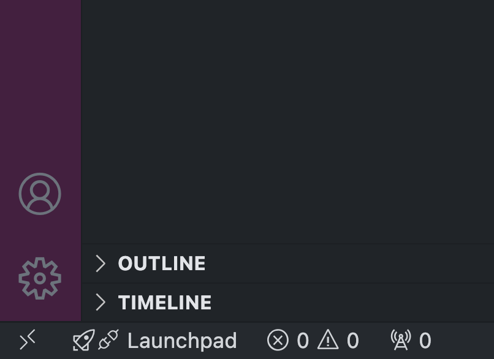

# Development Guides for dlomix PyTorch Implementation

This file provides guidelines for contributing PyTorch implementations to the dlomix project, a deep learning framework for proteomics.

Based on your environment, please follow the respective setup guide:

- [Dev Containers in VSCode](#dev-containers-in-vscode)
- [Local Development Guide](#local-development-guide)
- [Google Colab Development Guide](#google-colab-development-guide)

For contributing, please follow our [implementation guidelines](#implementation-guidelines)


## Dev Containers in VSCode

### Steps

1. Ensure you have Docker installed on your system and the docker daemon is running. To validate, please run the following command and ensure you do not get a listing of CONTAINER ID and other details:
```bash
docker ps
```
2. If you don't yet have docker installed, follow these instructions: https://docs.docker.com/engine/install/ubuntu/#install-using-the-repository

3. To run docker without sudo (VSCode requirement), follow these post-installation steps: https://docs.docker.com/engine/install/linux-postinstall/

4. Open VSCode and install the Devcontainers extensions from the extensions tab

5. Clone the forked GitHub repository of DLOmix https://github.com/omsh/dlomix

6. Open the repository in a DevContainer by clicking on the arrows in the botton left corner, and choosing "Reopen in Container".



7. During the first time, the container build will take some time and then VSCode will connect to the running container. Once it is done, please run the following command in the VSCode Terminal to install DLOmix with development packages in the editable mode:

```bash
make install-dev
```
8. You are now ready to make changes to the source code and see the impact directly. Once you make the changes, they should be reflected in the editable install inside your dev container.

VSCode Official Tutorial: https://code.visualstudio.com/docs/devcontainers/tutorial
VSCode documentaion for DevContainers: https://code.visualstudio.com/docs/devcontainers/containers


## Local Development Guide

### Environment Setup

#### Option 1: Using venv (Recommended)

1a. Create and activate a virtual environment:
```bash
python -m venv venv
# On Windows
.\venv\Scripts\activate
# On Unix or MacOS
source venv/bin/activate
```

#### Option 2: Using conda

1b. Create and activate a conda environment:
```bash
conda create -n dlomix python=3.9
conda activate dlomix
```

2. Clone the repository and `cd` into the directory of the cloned repo:
```bash
git clone https://github.com/omsh/dlomix.git
cd dlomix
```

3. Install development dependencies and ensure torch-related packages are in this file, otherwise extend it:
```bash
pip install -r ./.devcontainer/dev-requirements.txt
```

### DLOmix Editable installation

Install the package with the dev option and in editable mode:
```bash
pip install -e .[dev]
```


## Google Colab Development Guide

### Initial Setup

1. Create a new Colab notebook and mount your Google Drive:
```python
from google.colab import drive
drive.mount('/content/drive')
```

2. Clone the forked dlomix repository:
```bash
!git clone https://github.com/omsh/dlomix.git
```

3. Install development dependencies and ensure torch-related packages are in this file, otherwise extend it:
```bash
pip install -r ./dlomix/.devcontainer/dev-requirements.txt
```

4. Install the package in development mode:
```bash
!pip install -e "./dlomix[dev]"
```


## Implementation Guidelines

1. Add PyTorch implementations following the current project structure:
```
dlomix/
├── models/
│   ├── pytorch/
│   │   ├── __init__.py
│   │   └── model.py
│   └── existing_models/
```

2. Ensure compatibility with existing APIs:
```python
# dlomix/models/pytorch/model.py
import torch
import torch.nn as nn

# Example of maintaining consistent API
class PrositRTPyTorch(nn.Module):
    """PyTorch implementation of Prosit retention time model"""

    def __init__(self, *args, **kwargs):
        super().__init__()
        # PyTorch implementation here

    def forward(self, sequences):
        # Maintain same input/output structure as TensorFlow version

        return retention_times
```

3. Add corresponding tests:
```python
# tests/test_pytorch_models.py
import torch
import pytest
from dlomix.models.pytorch import PrositRTPyTorch

def test_model_compatibility():
    tf_model = PrositRT()  # Existing TF implementation
    pt_model = PrositRTPyTorch()

    # Test with same input
    sequence_input = "PEPTIDE"
    tf_output = tf_model.predict(sequence_input)
    pt_output = pt_model(torch.tensor(encoded_sequence))

    assert tf_output.shape == pt_output.detach().numpy().shape

def test_model_forward_pass():
    model = PrositRTPyTorch()
    expected_shape = (128, 1)
    input_size = 30

    x = torch.randn(128, input_size)  # Match existing input dimensions
    output = model(x)
    assert output.shape == expected_shape
```

4. Add a usage example of the new PyTorch implementation, preferably in a notebook under `./notebooks`


### Development Workflow

#### (Optional, but recommended) Pre-commit hooks
We use some simple pre-commit hooks to ensure consistency in file and code formatting. To use pre-commit hooks:
- install pre-commit with `pip install pre-commit`
- add the hooks by running in the root directory of the repo `pre-commit install`
- If you like, you can manually run the checks after staging but before commiting using `pre-commit run` to run the hooks against youur changes.

1. Create a new branch:
```bash
git checkout -b feature/FEATURE_NAME
```

2. Add your implementation

3. Write tests under `./tests` to ensure your code runs as expected.

4. Run the test suite using make:
```bash
make test-local
```

For google Colab you can run:
```bash
!python -m pytest tests/
```

5. Format your code using the project's style guidelines:
```bash
make format
```

6. Create a pull request with:
- Clear description of changes
- Any new dependencies added
- Mention the usage example under `./notebooks`


### General Considerations

1. Sequence Data :
   - Assume the same sequence encoding schemes

2. Model Architecture:
   - Closely mimic the existing Keras implementations or the original implementations of papers
   - Maintain similar model inputs and outputs (datatype, shape, etc..)
